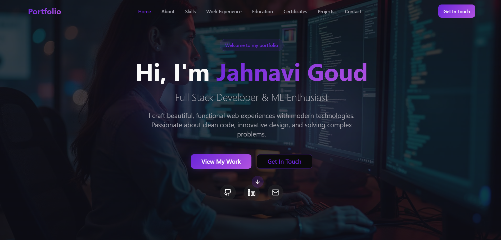
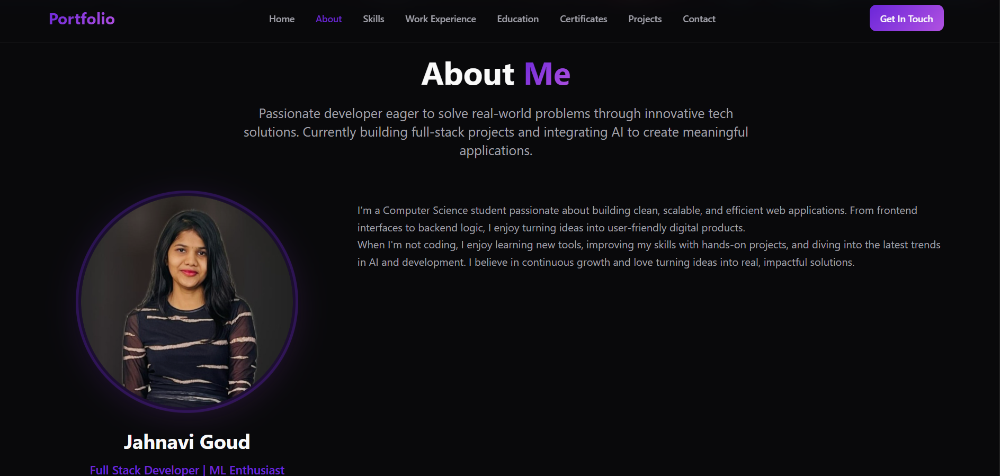

# Jahnavi Goud | Portfolio

A modern, responsive personal portfolio website to showcase my skills, projects, education, certifications, and work experience as a Full Stack Developer and Machine Learning Enthusiast.

## ✨ Features

- Professional landing page with hero section
- About me, skills, education, certificates, and work experience sections
- Projects gallery with links to code and live demos
- Contact form and social media links
- Fully responsive and mobile-friendly design
- Built with modern technologies and best practices

## 🖼️ Portfolio Previews


*Home page of the portfolio*


*About Me section preview*

## 🛠️ Tech Stack

- **React** (with Vite for fast development)
- **TypeScript**
- **Tailwind CSS** for styling
- **shadcn/ui** for beautiful UI components
- **Lucide Icons** for crisp, modern icons

## 📁 Project Structure

```text
my-portfolio/
├── public/                # Static assets (favicon, robots.txt, etc.)
├── src/
│   ├── assets/            # Images and media assets
│   ├── components/        # React components
│   │   └── ui/            # Reusable UI components (buttons, cards, etc.)
│   ├── hooks/             # Custom React hooks
│   ├── lib/               # Utility functions
│   ├── pages/             # Page components (main entry, 404, etc.)
│   ├── App.tsx            # Main app component
│   ├── main.tsx           # App entry point
│   └── index.css          # Global styles
├── index.html             # HTML template
├── package.json           # Project metadata and dependencies
├── tailwind.config.ts     # Tailwind CSS configuration
├── tsconfig.json          # TypeScript configuration
└── README.md              # Project documentation
```

## 🚀 Getting Started

### Prerequisites
- Node.js (v16 or higher recommended)
- npm or yarn

### Installation

```bash
# Clone the repository
git clone <your-repo-url>
cd my-portfolio

# Install dependencies
npm install
# or
yarn install

# Start the development server
npm run dev
# or
yarn dev
```

The app will be available at `http://localhost:8080` (or the port shown in your terminal).

## 🖼️ Customization
- Update your information in the components under `src/components/`
- Add or edit projects in `src/components/Projects.tsx`
- Update skills, certificates, and work experience as needed
- Replace the favicon in `public/favicon.ico` for a personalized browser tab icon

## 📦 Building for Production

```bash
npm run build
# or
yarn build
```
The production-ready files will be in the `dist/` directory.

## 📬 Contact

Feel free to connect with me:
- [LinkedIn](https://www.linkedin.com/in/jahnavigoud16/)
- [GitHub](https://github.com/jahnavi-16-12)
- Email: jahnavigoud16@gmail.com

---

© 2024 Jahnavi Goud. All rights reserved.
